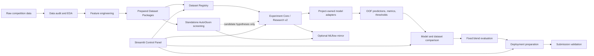

# Churn ML Experiment Platform

This repository began as a solution to a telecom customer-churn competition and
evolved into a controlled local platform for tabular machine-learning research. It
supports versioned datasets, reproducible experiments, model and dataset comparison,
leakage-aware blending, deployment preparation, and submission validation while
preserving the notebooks that document the original investigation.

The competition is a binary classification problem over anonymized,
high-dimensional tabular data. Its numerical and categorical features contain
extensive missingness, and only 13.05% of the labeled rows belong to the positive
class. The primary metric is **Balanced Accuracy**, so both sensitivity and
specificity matter. As the number of dataset versions, model families, thresholds,
and evaluation protocols grew, disconnected notebook state was no longer a reliable
way to compare results. The platform was built to make those decisions explicit and
auditable.

## Current status

> **As of 2026-08-01**
>
> | Item | Verified state |
> | --- | --- |
> | Development status | Active; the final academic candidate is not yet frozen |
> | Competition metric | Balanced Accuracy |
> | Labeled training rows | 10,000 |
> | Competition test rows | 2,500 |
> | Raw input features | 230 |
> | Positive-class rate | 13.05% |
> | Prepared Dataset Packages | Eight versioned packages, `v0` through `v7` |
> | Best verified Kaggle Public Score | **0.9112** |

The 0.9112 score is linked to the `v3_targeted_missingness` dataset and the
AutoGluon-screened, frozen `LightGBMPrep_r31` candidate at threshold 0.117. It is
reported as an external competition benchmark, not as a replacement for the
project-owned evaluation protocol. No current leaderboard rank is claimed.

## Why an experiment platform was built

The first project phase used notebooks for data audit, EDA, feature engineering,
three model families, and blending. That workflow was useful for discovery but became
fragile when experiments started varying dataset definitions, folds, seeds,
preprocessing, hyperparameters, thresholds, and blend weights at the same time.

The platform addresses four recurring problems:

- target leakage and optimistic threshold selection;
- stale or hidden notebook execution state;
- results that cannot be compared because their data or protocols differ;
- mutable local outputs with incomplete provenance.

The design also reflects lessons from earlier competition and hackathon work: a
reusable workflow should preserve evidence, fail closed when identities disagree,
and separate fast screening from authoritative evaluation.

## Architecture overview



Filesystem artifacts are authoritative. The Control Panel is an interface to
allowlisted public commands, and MLflow is an optional searchable mirror. AutoGluon
runs through a separate environment and runner; it does not silently replace
Research v2.

## Dataset management

A prepared Dataset Package contains ordered train/test features, the target, metadata,
and an immutable manifest. The manifest records schema and content hashes, row
identity, parent lineage, transformations, feature order, and target dependency. The
Registry performs strict read-only validation before a package can be used by the
generic Research v2 pipeline.

| Dataset ID | Features | Main transformation | Target dependency | Purpose |
| --- | ---: | --- | --- | --- |
| `v0_raw_minimal` | 205 | Remove constant and entirely missing columns | `none` | Minimal raw baseline |
| `v1_missingness_summary` | 213 | Add row-level missingness counts and rates | `none` | Test aggregate missingness signal |
| `v2_missingness_indicators` | 393 | Add broad feature-level missingness indicators | `none` | Test detailed missingness patterns |
| `v3_targeted_missingness` | 217 | Add four selected missingness indicators | `exploratory` | Study a compact target-informed indicator set |
| `v4_zero_value_summary` | 209 | Add row-level zero counts and rates | `none` | Test aggregate zero-value signal |
| `v5_joint_missingness_pattern` | 214 | Add a joint missingness-pattern feature | `none` | Represent combined data-collection states |
| `v6_compact_missingness_indicators` | 247 | Add structurally unique missingness indicators | `none` | Reduce redundant broad indicators |
| `v7_compact_zero_indicators` | 234 | Add compact feature-level zero indicators | `none` | Test which zero-valued fields carry signal |

`v3_targeted_missingness` is explicitly exploratory because its four indicators were
selected using target-informed evidence. Its results are kept separate from the
target-independent dataset ranking.

See the [Dataset Registry contract](docs/dataset-registry-v1.md) for package layout,
validation, and compatibility details.

## Experiment methodology

Research v2 is a train-only evaluation path with explicit data, pipeline, candidate,
and protocol identities. Depending on the configured plan, it supports stratified,
repeated, and nested evaluation. Preprocessing that learns from the target is fitted
inside the relevant training partition. Every completed run can preserve aligned OOF
probabilities, assignments, metrics, threshold evidence, resolved configuration,
environment metadata, and source hashes.

The methodology separates:

- smoke checks from development evidence;
- target-independent screening from exploratory experiments;
- hyperparameter search from unbiased confirmation;
- threshold selection from held-out evaluation;
- research evaluation from final full-data deployment.

Competition test data is not used for research evaluation. Thresholds and blend
weights are selected from training/OOF evidence rather than Kaggle feedback.
Deterministic seeds and ordered row identities make compatible runs suitable for
paired comparison.

Metrics from different protocols are **not automatically comparable**. Legacy
cross-fitting, AutoGluon validation, Research v2 development, nested confirmation,
and Kaggle Public Score answer different questions and are labeled separately.

## Model support

Project-owned candidate paths currently cover:

- LightGBM with fold-local out-of-fold target encoding;
- XGBoost through the numeric Research v2 adapter;
- CatBoost through the numeric Research v2 adapter;
- fixed LightGBM/XGBoost probability blends with leakage-aware cross-fitting;
- Optuna search contracts for XGBoost and CatBoost candidates.

Candidate adapters share the Experiment Core contract while keeping model-specific
fitting and probability behavior explicit. Fixed blends require compatible and
exactly aligned OOF evidence.

## AutoGluon role and disclosure

AutoGluon is used as an auxiliary high-throughput screening and orchestration tool to
identify promising model families, preprocessing recipes, and fixed hyperparameter
configurations. It is operationally isolated from the authoritative Research v2
workflow. Screening evidence does not replace the project-owned evaluation,
comparison, and deployment logic.

Three concepts are kept distinct:

1. **Automated portfolio screening** compares many framework-managed candidates.
2. **A frozen candidate configuration** fixes one discovered recipe for controlled
   follow-up.
3. **A project-owned manual pipeline** implements preprocessing, evaluation, fitting,
   thresholding, and artifact creation in this repository.

The best verified Kaggle result was discovered through AutoGluon screening and is
attributed accordingly. Project-owned manual LightGBM, XGBoost, CatBoost, and blend
results are reported separately. AutoGluon uses `.venv-autogluon`; the main platform
uses `.venv`.

## Platform capabilities

| Area | Current state |
| --- | --- |
| Dataset Registry, immutable manifests, lineage, hashes, row identity | Implemented |
| Experiment Core / Research v2 and candidate adapters | Implemented |
| Repeated/nested evaluation, OOF artifacts, threshold calibration | Implemented |
| Optuna lifecycle for supported numeric-tree adapters | Implemented |
| Same-dataset paired comparison | Implemented |
| Cross-dataset identity-aware comparison | Implemented |
| Fixed two-model blend evaluation and deployment package | Implemented |
| Deployment preparation and local submission validation | Implemented |
| Dataset Campaign / Matrix Runner | Implemented; the full primary campaign is not yet completed |
| Streamlit Control Panel and Research Workspace | Implemented, with some result views still incomplete |
| Optional filesystem-to-MLflow indexing | Implemented |
| Crash-isolated, train-only AutoGluon runner | Implemented |
| AutoGluon candidates as first-class Research v2 adapters | Partially integrated |
| Cross-dataset multi-model blending and campaign-results UI | Planned |

## Control Panel

The local Streamlit [Experiment Control Panel](docs/experiment-control-panel.md) is a
visual control surface over allowlisted CLI operations. It does not embed an
independent ML runtime. Its primary workflow is **Train → Compare → Tune → Blend →
Generate submission**.

The Run view can discover registered datasets, select a compatible model template,
materialize an immutable local configuration, validate it, and start a background
job. Jobs expose bounded logs and durable process state. Results provides artifact
inventory, inspection, filtering, comparison, a Dataset × model research workspace,
and a prepare-for-submission handoff.

<!-- SCREENSHOT TODO:
     file: docs/images/control-panel-run.png
     purpose: Show Registry-backed dataset/model selection and validation
-->

<!-- SCREENSHOT TODO:
     file: docs/images/control-panel-results.png
     purpose: Show the Research Workspace inventory and Dataset x model matrix
-->

Compare supports strict same-dataset paired comparison and a separate
identity-aware cross-dataset comparison. The campaign runner is exposed through
validated commands, but a dedicated campaign-results matrix remains planned.

<!-- SCREENSHOT TODO:
     file: docs/images/control-panel-compare.png
     purpose: Show paired model comparison and compatibility evidence
-->

<!-- SCREENSHOT TODO:
     file: docs/images/control-panel-dataset-comparison.png
     purpose: Show an identity-validated cross-dataset comparison
-->

Generate submission starts from a completed supported Research v2 run, builds a
reviewable deployment draft, authenticates competition assets, applies readiness
gates, and writes a local no-overwrite submission artifact. It does not upload to
Kaggle.

<!-- SCREENSHOT TODO:
     file: docs/images/control-panel-submission.png
     purpose: Show candidate readiness and the local submission workflow
-->

The [Control Panel user guide](docs/experiment-control-panel-user-guide.md) contains
the operational details.

## Example workflow

Competition data is not included in Git. Place the authorized files at:

```text
data/raw/final_proj_data.csv
data/raw/final_proj_test.csv
data/raw/final_proj_sample_submission.csv
```

From the repository root, prepare the main environment and validate local Dataset
Packages:

```powershell
uv sync --extra ui
uv run python scripts/run_dataset_registry.py scan --root data/processed
uv run python scripts/run_dataset_registry.py validate --root data/processed
```

Launch the Control Panel:

```powershell
uv run --extra ui streamlit run apps/experiment_control_panel.py
```

A typical controlled run is then:

1. Open **Run → Train** and choose the Registry-backed dataset-driven mode.
2. Select a dataset, model family, evaluation mode, and verified base template.
3. Prepare the configuration, inspect its identities, and run **Validate**.
4. Start the experiment and monitor it under **Jobs**.
5. Inspect completed evidence in **Results → Research Workspace**.
6. Use **Compare** for compatible model or dataset comparisons.
7. If justified, evaluate a fixed blend and prepare a deployment candidate.
8. Use **Generate submission** to review readiness and create a validated local CSV.

For a direct read-only CLI validation of a canonical configuration:

```powershell
uv run python scripts/run_research_v2.py `
  --config configs/research_v2/manual_lightgbm_te_v1_compat_smoke.yaml `
  --validate-only
```

## Results

Only results with verified local provenance are included. `v3_targeted_missingness`
is exploratory, and the internal scores below come from legacy or framework-specific
protocols rather than one common confirmation protocol.

| Evidence type | Dataset | Candidate | Threshold | Recorded internal Balanced Accuracy | Kaggle Public Score |
| --- | --- | --- | ---: | ---: | ---: |
| AutoGluon-screened frozen candidate | `v3_targeted_missingness` | `LightGBMPrep_r31` | 0.117 | 0.8952 | **0.9112** |
| Project-owned manual model | `v3_targeted_missingness` | Manual `LightGBMPrep_r31` reproduction | 0.117 | 0.898656 | 0.9023 |
| Project-owned manual blend | `v0_raw_minimal` | CatBoost 50% + XGBoost 50% | 0.130 | 0.8988 | 0.8832 |

The 0.9112 submission labels are exactly reproduced by thresholding the locally
exported `LightGBMPrep_r31` probabilities at 0.117. The manual reproduction is an
independent implementation and does not produce identical probabilities. Kaggle
Public Score is treated as an external benchmark, not the primary model-selection
criterion.

## Repository layout

| Path | Purpose |
| --- | --- |
| `apps/` | Streamlit Control Panel entry point |
| `configs/` | Versioned experiment, comparison, campaign, deployment, UI, MLflow, and AutoGluon contracts |
| `docs/` | Architecture, workflow, benchmark, and reproducibility documentation |
| `notebooks/` | Canonical academic investigation from audit through submission validation |
| `scripts/` | Public command-line entry points |
| `src/churn_ml/` | Dataset, experiment, model, evaluation, comparison, deployment, UI, and indexing implementation |
| `tests/` | Contract, lifecycle, parity, security, and workflow tests |
| `data/` | Local raw and generated data; competition assets are ignored |
| `artifacts/` | Local authoritative run artifacts; ignored by default |
| `mlruns/` | Optional local tracking state; ignored by default |
| `submissions/` | Local competition CSV files; ignored by default |

## Environments and quick start

The repository uses Python 3.12 and `uv` with a committed lockfile.

- `.venv` is the main project environment for notebooks, Research v2, the Control
  Panel, tests, deployment, and MLflow indexing.
- `.venv-autogluon` is an isolated environment used only by the standalone AutoGluon
  runner. Its dependencies must not be merged into the main environment.

Install the locked main dependencies, including the UI extra:

```powershell
uv sync --extra ui
```

Useful read-only validation and test commands are:

```powershell
uv lock --check
uv run python scripts/run_dataset_registry.py validate --root data/processed
uv run pytest
```

AutoGluon usage and environment boundaries are documented in the
[standalone runner guide](docs/autogluon-standalone-runner.md). Raw data, processed
datasets, predictors, model binaries, MLflow state, and submissions are generated or
local assets and are not committed by default.

## Notebook map

| Notebook | Role |
| --- | --- |
| `01_data_audit.ipynb` | Input validation, schema audit, target distribution, and train/test consistency |
| `02_eda.ipynb` | Missingness, cardinality, numerical/categorical analysis, and exploratory findings |
| `03_feature_engineering.ipynb` | Versioned feature hypotheses and prepared Dataset Package construction |
| `04_catboost_baseline.ipynb` | CatBoost baseline evaluation |
| `05_lightgbm_baseline.ipynb` | LightGBM baseline evaluation |
| `06_xgboost_baseline.ipynb` | XGBoost baseline evaluation |
| `07_model_comparison.ipynb` | Model comparison and fixed blend analysis |
| `08_submission.ipynb` | Submission construction and validation from selected prediction artifacts |

These notebooks preserve the academic investigation. The reusable platform code and
tests are the preferred source for current experiment contracts and lifecycle logic.

## Reproducibility and artifact policy

Each controlled run receives an identity and a dedicated no-overwrite artifact
directory. Depending on the workflow, retained evidence includes resolved configs,
dataset manifests and hashes, source identity, feature order, fold assignments, seeds,
OOF predictions, threshold summaries, metrics, environment metadata, and terminal
success or failure markers.

Historical evidence is immutable by default. Readers validate artifact contracts
rather than silently relabeling older results. Filesystem artifacts remain
authoritative; [MLflow local indexing](docs/mlflow-local-index.md) adds a searchable
mirror without loading models or rewriting source artifacts.

Raw competition data, processed packages, trained models, MLflow databases, and
submission files remain local and ignored unless explicitly published under a
separate data or artifact policy.

## Academic integrity and leakage controls

- Competition test rows are excluded from research evaluation.
- Known labels from the Orange reference dataset are not extracted or used for the
  competition test rows.
- `v3_targeted_missingness` is marked `target_dependency: exploratory` and is not
  mixed into the target-independent dataset ranking.
- Target encoding and threshold selection are fold-local where required by the
  configured protocol.
- AutoGluon is disclosed as auxiliary screening infrastructure.
- Project-owned manual model, comparison, blending, and deployment paths exist.
- Competition data is not distributed by this repository.

## Limitations

- Some code still assumes this competition's binary `index,y` schema, 10,000/2,500
  row counts, or legacy feature contracts.
- Legacy notebook-era evaluation and Research v2 coexist.
- The full planned dataset-by-model screening campaign has not been completed.
- Campaign-scale result views and cross-dataset multi-model blending are incomplete.
- AutoGluon candidates are not yet first-class Research v2 adapters.
- Some AutoGluon and repeated-evaluation workloads require significant memory and
  careful resource isolation.
- Active development may change the final selected competition result.

## Roadmap

Post-competition directions include:

- generic dataset and task schemas;
- reusable ingestion adapters and competition templates;
- multiclass classification and regression support;
- pluggable isolated model workers;
- broader campaign orchestration and report generation;
- CI-based reproducibility and artifact-contract checks;
- Docker packaging and portable service startup;
- remote artifact storage with immutable identities;
- generalized cross-dataset and multi-model blending.

These are directions, not claims about current implementation.

## Documentation index

- [Current project status](docs/current-project-status.md) — detailed operational
  handoff and active-development state.
- [Experiment Control Panel](docs/experiment-control-panel.md) — UI architecture and
  safety contracts.
- [Control Panel user guide](docs/experiment-control-panel-user-guide.md) — setup and
  operator workflow.
- [Dataset Registry v1](docs/dataset-registry-v1.md) — Dataset Package and validation
  contract.
- [Dataset Campaign Runner v1](docs/dataset-campaign-runner-v1.md) — matrix planning,
  freezing, execution, and resume.
- [Research v2 paired comparison](docs/research-v2-paired-comparison.md) — compatible
  same-dataset comparison.
- [Dataset Comparison v1](docs/dataset-comparison-v1.md) — identity-aware
  cross-dataset comparison.
- [Blend Evaluation v1](docs/blend-evaluation-v1.md) — fixed cross-fitted blend
  evaluation.
- [Optuna Search v1](docs/optuna-search-v1.md) — controlled hyperparameter-search
  lifecycle.
- [Deployment v1](docs/deployment-v1.md) — final refit, prediction, and submission
  validation contracts.
- [Standalone AutoGluon runner](docs/autogluon-standalone-runner.md) — isolated
  auxiliary screening.
- [MLflow local index](docs/mlflow-local-index.md) — optional searchable mirror.
- [Historical baseline manifest](docs/reproducibility/baseline_manifest.yaml) — scope
  of the earlier v0-v3 reproduction contract.
