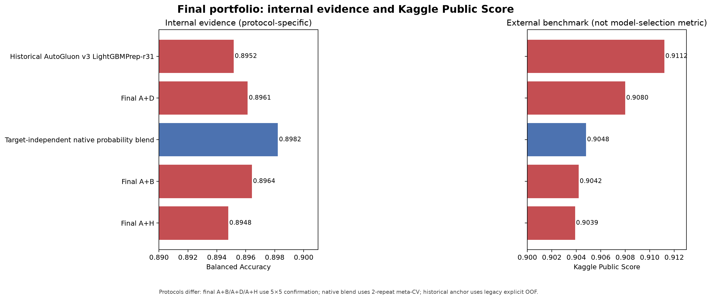
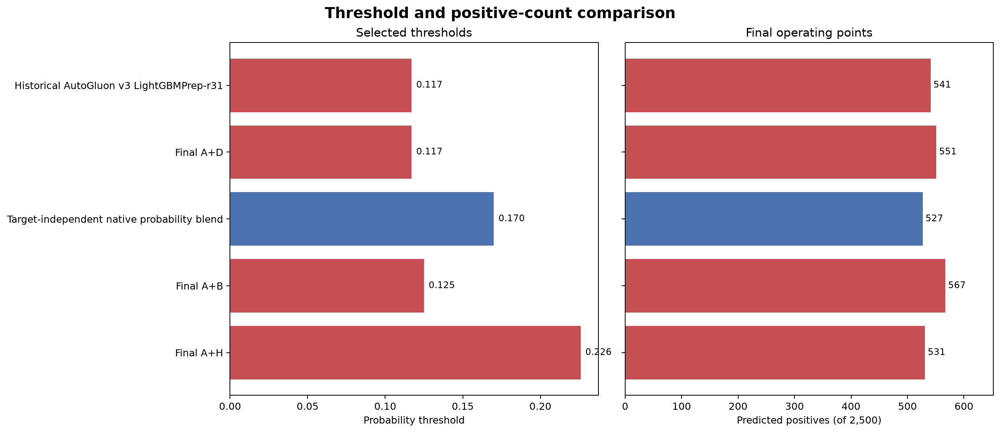
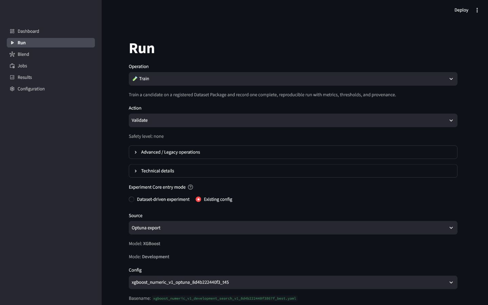
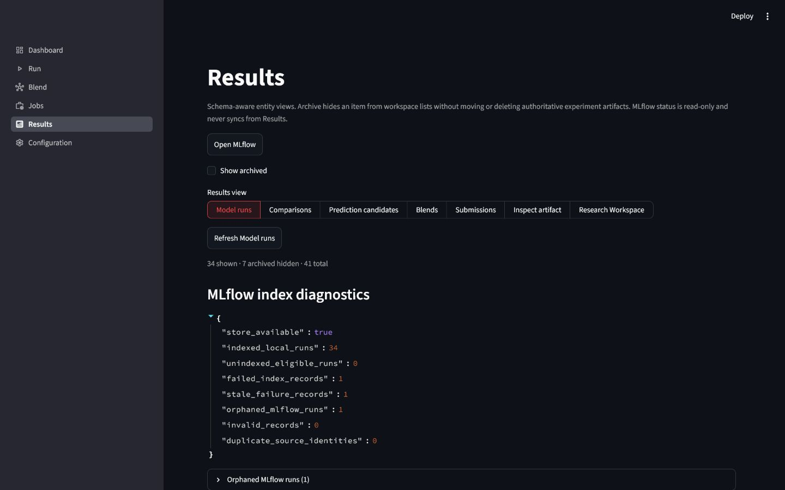
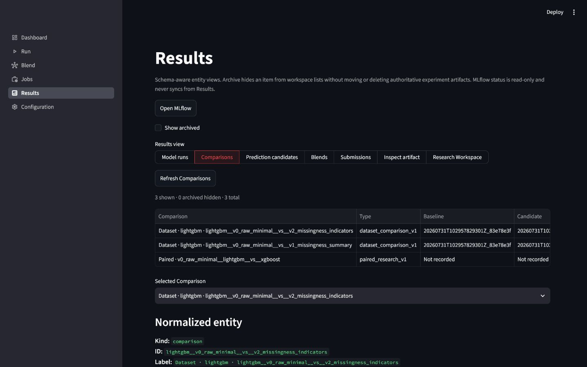
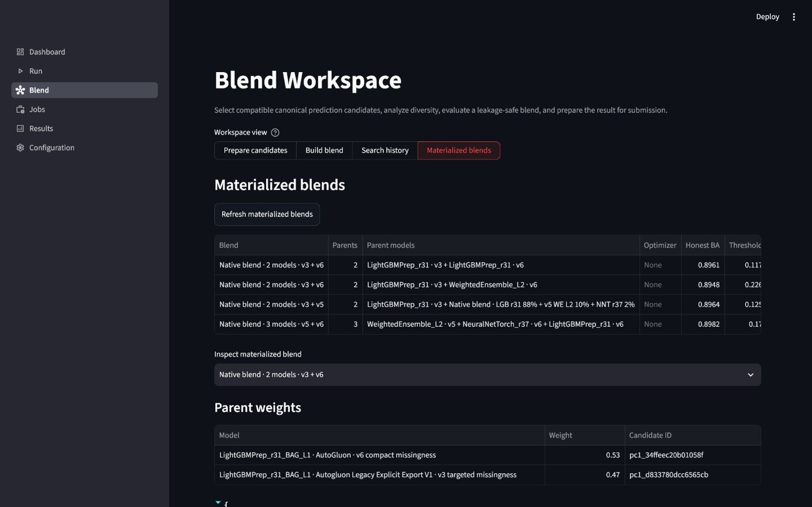
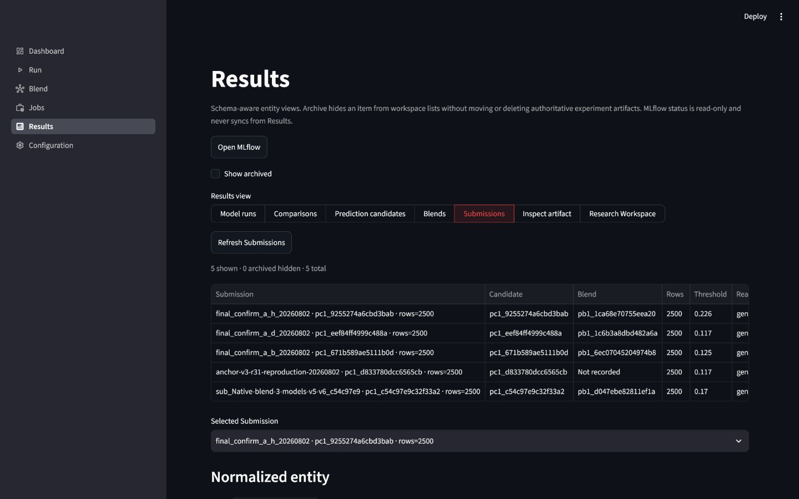

# Прогнозування відтоку клієнтів і платформа ML-експериментів

[English technical README](README.md) · [Фінальний виконаний notebook](notebooks/09_final_project_report.ipynb) · [Компактні докази](reports/final/README.md) · [Відтворюваність](docs/final-reproducibility.md) · [Фінальний аудит](docs/final-audit.md)

Це фінальний академічний проєкт із бінарної класифікації відтоку клієнтів
телеком-компанії. Окрім моделей, реалізовано платформу, яка фіксує версії
датасетів, folds, seeds, OOF-прогнози, thresholds, comparisons, blending,
provenance та готовність submission. Основна метрика — **Balanced Accuracy**.

## Фінальний статус

> **Станом на 02.08.2026**

| Показник | Результат |
|---|---|
| Train / test | 10 000 / 2 500 рядків |
| Сирі ознаки / позитивний клас | 230 / 13,05% (1 305 рядків) |
| Найкращий перевірений Kaggle Public Score | **0,9112** |
| Найстабільніший фінальний internal candidate | A+B: mean BA **0,896420**, std **0,000438** |
| Найкращий новий Public результат | A+D: **0,9080** |
| Фінальний portfolio | 5 заморожених submissions |

Private Score і фінальне місце ще невідомі. Kaggle Public Score є зовнішнім
benchmark, а не критерієм налаштування ознак, threshold чи blend weights.

## Робочий процес

1. Аудит типів, пропусків, константних/порожніх ознак, дисбалансу та row identity.
2. EDA числових і категоріальних ознак, missingness, cardinality і zero patterns.
3. Immutable Dataset Packages `v0`–`v7` із lineage, ordered schema та hashes.
4. Research v2 runs для Logistic Regression, CatBoost, LightGBM і XGBoost;
   ізольований AutoGluon-контур.
5. OOF-aligned comparisons, fold-local threshold selection і frozen campaigns.
6. Leakage-safe blending із native/Optuna backends та repeated meta-CV.
7. Локальна генерація submission із schema/order/positive-count/SHA validation;
   платформа не виконує Kaggle upload.

## Аудит даних та Dataset Packages

Train містить 8 695 негативних і 1 305 позитивних прикладів. Через дисбаланс
звичайна accuracy могла б приховувати слабку sensitivity. EDA показав, що
missingness і нульові значення можуть відображати стан клієнта або процес збору
даних, тому вони стали окремими гіпотезами.

| Dataset Package | Ознак | Parent | Гіпотеза | Dependency |
|---|---:|---|---|---|
| `v0_raw_minimal` | 205 | — | Видалення константних і порожніх ознак | `none` |
| `v1_missingness_summary` | 213 | `v0` | Сумарні missingness counts/rates | `none` |
| `v2_missingness_indicators` | 393 | `v0` | Широкі missingness-індикатори | `none` |
| `v3_targeted_missingness` | 217 | `v1` | Чотири target-informed індикатори | **`exploratory`** |
| `v4_zero_value_summary` | 209 | `v0` | Сумарні zero counts/rates | `none` |
| `v5_joint_missingness_pattern` | 214 | `v1` | Спільний патерн пропусків | `none` |
| `v6_compact_missingness_indicators` | 247 | `v1` | Унікальні missingness-індикатори | `none` |
| `v7_compact_zero_indicators` | 234 | `v4` | Компактні zero-індикатори | `none` |

`v3_targeted_missingness` є **exploratory**, бо індикатори вибрано після
аналізу зв'язку з target. Він не змішується з неупередженим рейтингом пакетів;
усі downstream candidates також явно позначені exploratory.

## Моделі та AutoGluon

| Сімейство | Роль |
|---|---|
| Logistic Regression | Прозорий baseline |
| CatBoost | Контрольований boosted-tree comparison |
| LightGBM | Сильні ручні та AutoGluon-screened candidates |
| XGBoost | Tree baseline і cross-model diversity |
| AutoGluon ensembles | Bagged models, WeightedEnsemble, explicit exports |
| NeuralNetTorch | Diversity screen; відхилено через відсутність honest gain |

Historical candidate `pc1_d833780dcc6565cb` — `LightGBMPrep_r31_BAG_L1` на
exploratory `v3`. Його labels відтворено з model-specific explicit OOF/test
exports без predictor loading, in-sample fallback або повторного навчання.
AutoGluon залишається в окремій `.venv-autogluon`.

## Платформа та методологія

| Компонент | Реалізовано |
|---|---|
| Dataset Registry | Immutable packages, lineage, roles, schema/content/row hashes |
| Research v2 | Repeated evaluation, aligned OOF, threshold evidence |
| Comparisons | Строгий paired gate і row-aligned cross-dataset comparison |
| Candidates | Canonical contract, managed та explicit AutoGluon import |
| Blending | Native/Optuna, honest repeated meta-CV, diversity analysis |
| Campaign Runner | Frozen/resumable plans, ranking, selective materialization |
| Submission | Schema, row order, positives, SHA; без upload |
| Control Panel | Allowlisted Run, Results, Compare, Blend, Submissions |

OOF prediction для рядка створює модель, яка не бачила його під час fit.
Repeated/nested validation відокремлює outer evaluation від threshold selection.
Weights фіксуються до фінального threshold. Honest meta-CV використовує held-out
decisions; full-OOF deployment metric є descriptive. Public Score не
використовувався для feature, threshold або weight tuning.

Окрема campaign-results matrix і частина canonical Tune/Blend handoffs у UI ще
не завершені; проєкт не заявляє повну готовність кожного бажаного result view.

## Фінальна confirmation campaign

`exploratory_confirmation_v1`: plan hash
`857e146a11c8591032fab8e8f3d1994e391fff2ef38e0cc4df2ade3a696dc172`,
5 folds × 5 repeats, seed 42, deterministic native pair optimization,
pairwise step 0,01, threshold grid 0,05–0,30 з кроком 0,001.

| Експеримент | Honest mean BA | Std | Min repeat | Full-OOF descriptive BA | Threshold | Позитивів | Public |
|---|---:|---:|---:|---:|---:|---:|---:|
| Baseline A | 0,892843 | 0,001462 | 0,890291 | 0,895158 | 0,117 | 541 | 0,9112 |
| A+B | **0,896420** | **0,000438** | **0,895712** | 0,900249 | 0,125 | 567 | 0,9042 |
| A+D | 0,896129 | 0,001352 | 0,894466 | 0,900558 | 0,117 | 551 | **0,9080** |
| A+H | 0,894780 | 0,001555 | 0,892477 | 0,897593 | 0,226 | 531 | 0,9039 |

A+B і A+D покращили anchor у спільному project-owned протоколі. A+B був
найстабільнішим internal candidate; A+D отримав найкращий новий Public Score.

*Ліва панель зберігає protocol labels; права показує зовнішній Public benchmark.
Червоні кандидати залежать від exploratory `v3`.*

*Operating points фінального portfolio на 2 500 test rows.*

## Чому 0,9112 залишився найкращим

Historical AutoGluon-screened candidate мав Public Score **0,9112**. A+B був
кращим і стабільнішим у honest confirmation, але отримав 0,9042 Public. A+D
став найкращим новим Public результатом — 0,9080. Public leaderboard оцінює
лише підмножину hidden labels, тому його ordering не зобов'язаний повторювати
repeated local validation. Припущень про Private Score немає.

## Neural diversity screen

`exploratory_neural_screen_v1`, plan hash
`05bc790326ca6419a47a46da9a016abfe17d779a66bffeca6462036186b94566`:
anchor 0,892843, A + `NeuralNetTorch_r31` 0,892420. Neural candidate не
покращив anchor, тому його виключено з подальшого blending.

## П'ять вибраних submissions

| # | Submission | Candidate / blend | Threshold | Позитивів | Public | Exploratory |
|---:|---|---|---:|---:|---:|---|
| 1 | Historical AutoGluon v3 LightGBMPrep-r31 | `pc1_d833780dcc6565cb` | 0,117 | 541 | **0,9112** | Так |
| 2 | Final A+D | `pc1_eef84ff4999c488a` / `pb1_1c6b3a8dbd482a6a` | 0,117 | 551 | 0,9080 | Так |
| 3 | Target-independent native blend | `pc1_c54c97e9c32f33a2` / `pb1_d047ebe82811ef1a` | 0,170 | 527 | 0,9048 | Ні |
| 4 | Final A+B | `pc1_671b589ae5111b0d` / `pb1_6ec07045204974b8` | 0,125 | 567 | 0,9042 | Так |
| 5 | Final A+H | `pc1_9255274a6cbd3bab` / `pb1_1ca68e70755eea20` | 0,226 | 531 | 0,9039 | Так |

## Control Panel

*Явні operation, action, source, model, mode і safety summary.*

*Schema-aware inventory; filesystem artifacts залишаються authoritative.*

*Recorded comparisons із normalized identity.*

*Materialized blends із honest BA, thresholds і parent weights.*

*Рівно п'ять локальних submissions; Kaggle upload відсутній.*

## Відтворюваність та artifacts

| Рівень | Що відтворюється | Вимоги |
|---|---|---|
| 1 — Repository-only | Notebook 09, таблиці, графіки | Clean clone і main `.venv` |
| 2 — Local submission | Readiness і exact regeneration | Canonical ignored artifacts |
| 3 — Full reconstruction | Packages та historical experiments | Авторизовані data, дві environments, значні ресурси |

Локальний workspace може перевищувати 22 GB і 100 000 generated files. Raw data,
processed packages, predictors, binaries, OOF/test probabilities, campaign/MLflow
state і submission CSV навмисно не потрапляють у Git. Див.
[інструкції](docs/final-reproducibility.md).

## Обмеження та висновки

`v3` є target-informed exploratory dataset; internal protocols не повністю
взаємозамінні; Public ordering не розкриває Private; bitwise retraining між
hardware/library versions не заявляється. Honest confirmation показала перевагу
A+B та A+D; A+B був найстабільнішим, A+D дав найкращий новий Public Score
0,9080, а historical candidate зберіг найкращий перевірений результат 0,9112.
Portfolio, hashes, executed notebook, screenshots і межі відтворюваності
зафіксовано для академічної перевірки.
